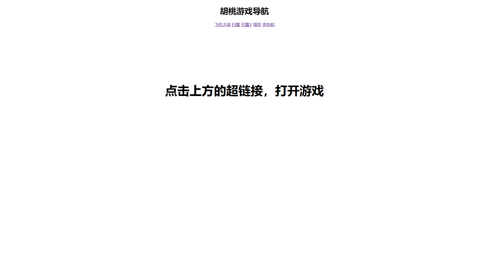

# 游戏导航页

## 声明
随便写的东西，有问题就到issues说(不过这种东西总不会有bug吧)
## 简介
1.导航页部分由@XxhutaoxX编写，游戏部分使用了GitHub上的源码  
2.允许进行私人改编。（需要在代码中添加注释&lt!-- Written by Hutao --&gt）  
3.使用html，css进行编写  
4.胡桃游戏导航页可以做到无需刷新的切换游戏
## 部署

这么简单的还要教？（如果实在需要就点开我吧）

<pre><code>
将源码下载下来然后找到源码文件夹的index.html文件
</code></pre>

## Demo

## Star History
